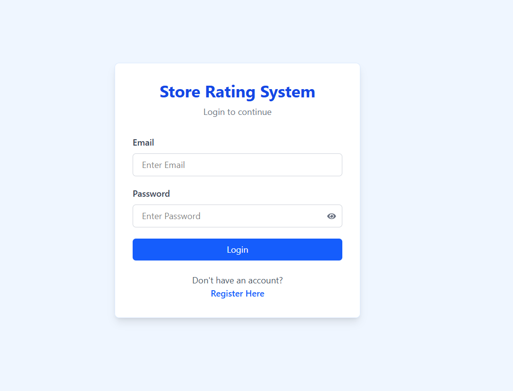
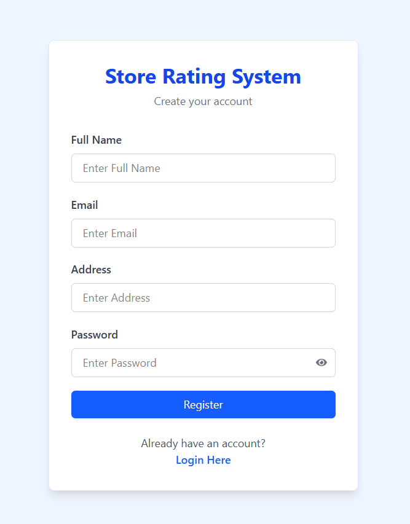
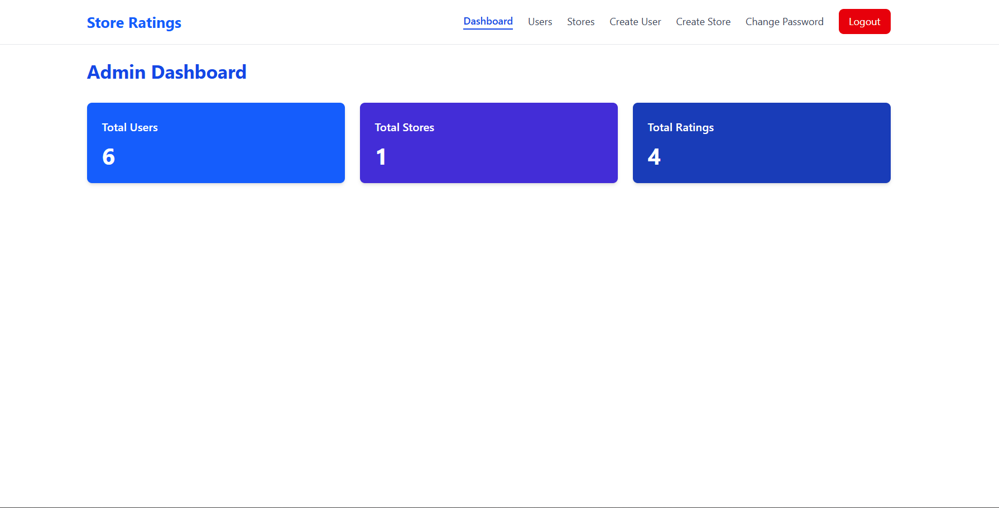
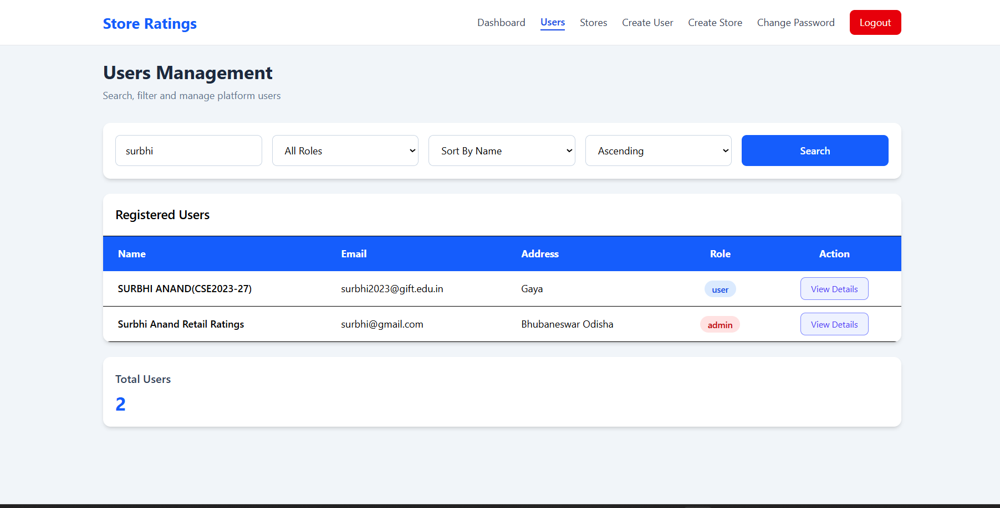
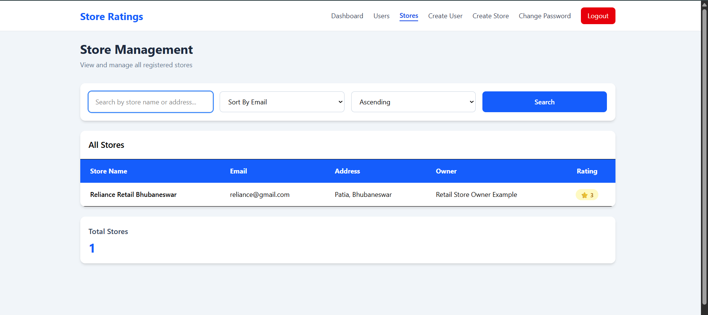
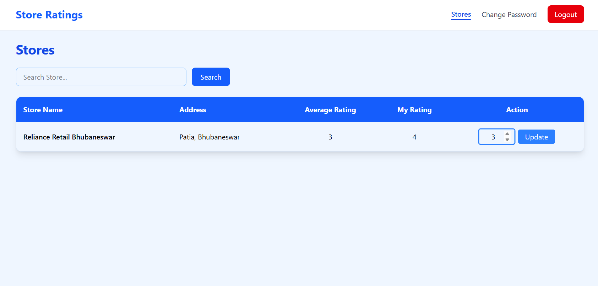
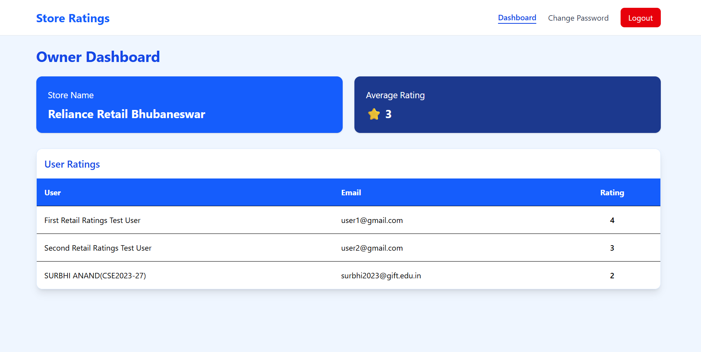

# 📌 Store Rating System

A full-stack role-based Store Rating System built using the **MERN stack (MongoDB, Express, React, Node.js)** with **JWT authentication** and **role-based dashboards for Admin, User, and Store Owner**.

---

# 🚀 Features

## 🔐 Authentication
- User Registration
- Secure Login using JWT
- Change Password
- Logout functionality

---

## 👥 Role-Based Access Control

### 👨‍💼 Admin
- Create users
- Create stores
- View all users
- View all stores
- View user details
- Filter and sort users

### 👤 User
- View all stores
- Search stores
- Submit rating (1–5)
- Update rating

### 🏪 Store Owner
- View assigned store
- View ratings for store
- View average rating

---

## ⭐ Rating System
- Users can rate stores from 1 to 5
- Users can update their rating
- Average rating is calculated dynamically

---

## 🎨 UI Features
- React + Tailwind CSS
- Protected routes
- Form validation
- Responsive design

---

# 🧱 Tech Stack

## Frontend
- React.js
- Tailwind CSS
- Axios
- React Router DOM

## Backend
- Node.js
- Express.js
- MongoDB + Mongoose
- JWT Authentication
- bcrypt.js

---

# 📁 Project Structure

---

# ⚙️ Setup Instructions

## 1️⃣ Clone Repository
```bash
git clone https://github.com/surbhi-anand03/store-rating-system.git
cd store-rating-system

```
# 🔑 Test Credentials

### 👨‍💼 Admin
- Email: surbhi@gmail.com  
- Password: Password@Admin  

### 👤 User
- Email: user1@gmail.com
- Password: Password@1  

### 🏪 Owner
- Email: owner@gmail.com  
- Password: Password@1  

# 📸 Screenshots

## 🔐 Login


## 📝 Register


## 👨‍💼 Admin Dashboard


## 👥 Admin Users


## 🏪 Admin Stores


## 👤 User Page


## 🏪 Owner Dashboard

